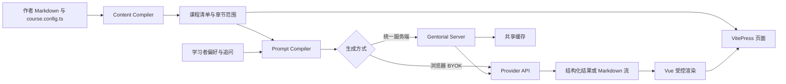

# Gentorial 路线图

> 本文只记录当前状态、稳定边界和后续工作。具体使用方法以[技术文档](https://gentorial.github.io/gentorial/docs/)为准，公开 API 以各包导出和 README 为准。
>
> 更新日期：2026-07-15

## 1. 当前状态

Gentorial 已发布首批 npm 包，并完成从 Markdown 创作到浏览器生成、托管生成服务和 VitePress 渲染的纵向链路。当前仍处于 `0.x` 阶段，API 在 `1.0` 前可能调整。

| 能力 | 状态 | 说明 |
| --- | --- | --- |
| 课程、概念、章节范围和生成协议 | 已完成 | 位于 `@gentorial/core` |
| Markdown 指令与课程目录编译 | 已完成 | 位于 `@gentorial/content` |
| VitePress 引擎与默认主题 | 已完成 | 支持标题触发、正文后渲染、重新生成、追问和学习路径树 |
| 浏览器 BYOK | 已完成 | 支持 OpenAI、Anthropic、Google 和 OpenAI-compatible |
| 托管生成服务 | 已完成首版 | 支持服务端凭据、文件缓存、SSE/JSON 响应和取消传播 |
| 交互式脚手架 | 已完成首版 | 可创建纯前端或带服务端项目，模板随 npm 包发布 |
| 技术文档站 | 已完成首版 | 包含创作、BYOK、服务端、配置和部署指南 |
| 单元与组件测试 | 已接入 | Vitest 覆盖核心包和运行时 |
| 浏览器端到端测试 | 已接入 | Playwright 覆盖 BYOK、流式生成、追问和失败路径 |
| 作者快照 | 未实现 | 构建时生成、审核和失效策略仍待设计落地 |
| C 语言领域插件 | 未实现 | 不属于当前公开包 |
| Nuxt 引擎 | 未实现 | VitePress 仍是唯一正式支持的页面引擎 |

当前公开包版本并不统一，Changesets 按实际影响独立升级。不要从单个包的版本推断整个仓库的成熟度。

## 2. 产品边界

Gentorial 是生成式教程框架，不是通用聊天组件、CMS 或 LMS。

作者负责：

- 在 Markdown 中写明始终可读的课程正文。
- 用稳定 ID 声明概念锚点。
- 用章节范围和短提示声明可生成的讲解位置。
- 审核提供方、隐私、内容策略和生成结果质量。

框架负责：

- 将课程定义、章节范围、概念和学习者偏好组合为生成请求。
- 连接浏览器 BYOK 或服务端生成器。
- 管理请求、取消、过期响应、重新生成和追问状态。
- 使用受控课程块或 Markdown 渲染模型输出。
- 在生成不可用时保留作者原文。

第一阶段不包含账号、付费、班级管理、学习数据后台或通用内容管理。

## 3. 稳定设计原则

### 3.1 概念明文，叙事生成

概念锚点和章节原文属于作者内容。学习者偏好可以改变详略、语气、叙事和示例，不能修改作者原文或反转明确概念。

### 3.2 失败时仍是一份教程

AI 是附加层。无密钥、断网、限流、协议错误或校验失败都不能删除或覆盖作者正文。默认模板不提供 mock 生成内容。

### 3.3 密钥边界明确

- 浏览器 BYOK 只使用学习者主动提供的凭据。
- 课程作者的生产凭据只能存在于服务端环境变量或受控密钥服务。
- 密钥不得进入 Git、静态产物、缓存键或日志。

### 3.4 依赖方向保持单向

| 层 | 包 | 主要边界 |
| --- | --- | --- |
| 协议 | `@gentorial/core` | 不依赖 Vue、VitePress、提供方 SDK 或文件系统 |
| 内容 | `@gentorial/content` | 依赖 core；Node 子入口负责目录编译 |
| AI | `@gentorial/ai` | 依赖 core；不依赖页面引擎 |
| 运行时 | `@gentorial/runtime-vue` | 依赖 core 和 Vue |
| 引擎 | `@gentorial/engine-vitepress` | 连接内容协议和 VitePress Markdown |
| 主题 | `@gentorial/theme-default` | 组合 Vue 运行时与 VitePress 默认主题 |
| 服务 | `@gentorial/server` | 只在服务端运行，管理凭据和共享缓存 |
| 工具 | `@gentorial/create` | 初始化可独立安装和运行的项目 |

## 4. 当前架构



两条生成路径共享课程输入和运行时状态，但凭据与缓存边界不同：BYOK 绕过课程服务端及共享缓存；统一服务端集中控制 Provider、模型、凭据和缓存。

统一服务端只接受课程与生成位置引用、作者定义哈希、学习者偏好和追问，并从服务端可信 manifest 重建正文、提示词和概念。BYOK 仍直接使用浏览器当前页面中的完整课程输入。

## 5. 质量基线

日常检查：

```bash
pnpm check
pnpm test:e2e
pnpm -r --filter "./packages/*" run pack:check
```

当前 CI：

- Windows 与 Ubuntu。
- Node.js 22.13 和 24。
- 全量构建、TypeScript 检查和 Vitest。
- 所有公开包执行 npm tarball dry-run。
- Ubuntu/Chromium 执行 Playwright 端到端测试。

行为变更必须提供相应层级的测试。浏览器交互、生成路径或脚手架产物发生变化时，应优先补端到端或 tarball 验收，而不只补单元测试。

## 6. 发布前剩余工作

以下工作决定何时可以把当前版本推荐给正式课程：

1. 从 `@gentorial/create` 的实际 tarball 初始化临时项目，执行安装、启动和生产构建。
2. 为至少一个真实 Provider 建立受控 smoke test；凭据只由 CI secret 提供，默认 PR 不运行。
3. 为托管服务补充生产部署参考实现或中间件示例，包括鉴权、限流、请求尺寸和配额。
4. 建立 npm trusted publishing、provenance、发布审批和回滚说明。
5. 明确公开 API 的兼容策略、弃用周期和 1.0 准入条件。
6. 在真实课程中完成一次小规模试点，并记录内容质量与故障处理结果。

## 7. 路线图

### 近期：生产候选版

- 完成脚手架 tarball 端到端测试。
- 增加真实 Provider 可选 smoke test。
- 完善服务端安全与部署说明。
- 自动化发布和 provenance。
- 收集真实课程试用反馈并修复阻塞问题。

### 中期：可审核与可复现

- 设计作者快照命令和文件格式。
- 使用课程内容、概念、策略、模型和 Prompt 修订生成稳定缓存身份。
- 支持快照审核、失效、更新和静态回退。
- 增加诊断命令和课程配置 JSON Schema。

### 后期：扩展验证

- 在真实 C 教程试点领域校验插件，不先发布空包。
- 核心协议在 VitePress 项目中稳定后，再评估 Nuxt 引擎。
- 只有同一课程源能跨引擎复用时，才把第二引擎列为正式支持能力。

## 8. 1.0 准入条件

`1.0` 不要求实现所有设想，但至少需要满足：

- 核心课程、生成和渲染 API 有明确兼容承诺。
- 创建项目、浏览器 BYOK、统一服务端和生产构建均有自动化验收。
- 至少一个真实课程完成持续试用。
- 安全、隐私、缓存、升级和故障处理文档完整。
- 发布流程可审计、可重复并支持回滚。
- 没有已知会破坏作者原文或泄露凭据的高优先级问题。

C 插件、Nuxt 引擎和完整 LMS 能力不是 `1.0` 的强制前置条件，除非后续产品范围明确调整。

## 9. 决策记录

| 决策 | 当前结论 |
| --- | --- |
| 默认页面引擎 | VitePress |
| 浏览器框架 | Vue 3 |
| 作者格式 | Markdown + `course.config.ts` |
| 生成位置 | 最近标题绑定，作者原文之后 |
| 默认无 AI 行为 | 保留原文，生成操作显示配置或请求错误 |
| 默认 mock | 不提供 |
| 浏览器凭据 | 学习者主动 BYOK，默认页面内存保存 |
| 托管凭据 | 服务端环境变量或受控密钥服务 |
| 服务端缓存 | 可替换存储；默认文件缓存适合单实例 |
| 版本管理 | Changesets，多包独立版本 |
| 当前许可证 | MIT |

改变稳定设计原则、依赖方向、安全边界或 1.0 准入条件时，应同时更新本文和对应技术文档。
